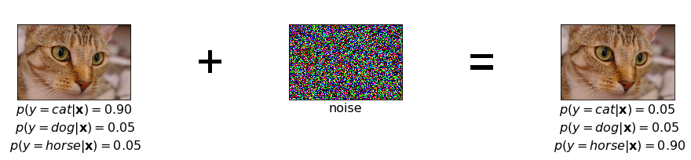
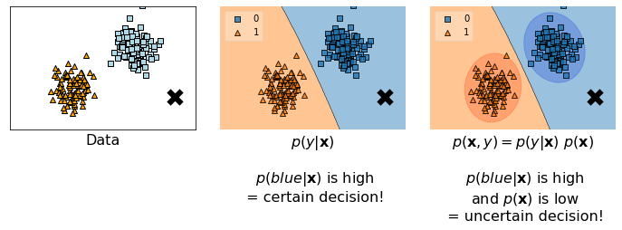

翻译自：https://jmtomczak.github.io/blog/1/1_introduction.html

# 引言

## 为什么选择生成模型？

在我们开始思考（深度）生成模型之前，让我们先考虑一个简单的例子。假设我们训练了一个深度神经网络来对动物的图像（$\mathbf{x} \in \mathbb{Z}^D$）进行分类（$y \in \mathcal{Y}, \mathcal{Y}=\{c a t, \text { dog }, \text { horse }\}$）。此外，假设该神经网络经过充分训练，因此它总是以高概率$p(y \mid \mathbf{x})$分类为正确的类别。然而，(Szegedy et al., 2013) 指出，向图像中添加噪声可能会导致完全错误的分类。图1展示了这种情况的一个例子，其中添加噪声可能会改变预测标签的概率分布，但图像几乎没有发生变化。

**图1**：在几乎完全正确分类的图像中添加噪声的示例，这导致了预测标签的偏移。

这个例子表明，用于参数化条件分布$p(y \mid \mathbf{x})$的神经网络缺乏对图像的语义理解。进一步来说，我们甚至可以假设，仅仅学习判别模型不足以进行正确的决策和创建AI。一个机器学习系统不能仅依赖于学习如何做出决策，而不理解现实世界，也不能表达对周围世界的不确定性。如果少量噪声就能改变它的内部置信度，并将其确定性从一个决策转移到另一个决策上，我们如何信任这样的系统？如果它无法正确表达其对周围环境的新颖性判断，我们如何与之交流？

为了说明不确定性和理解在决策中的重要性，让我们考虑一个分类系统，这次是将对象分为两个类别：橙色和蓝色。假设我们有一些二维数据（图2，左侧）以及一个要分类的新数据点（图2中的黑色交叉）。我们可以使用两种方法做出决策。首先，可以通过模型条件分布$p(y \mid \mathbf{x})$（图2，中间）明确地构建分类器。其次，我们可以考虑联合分布$p(\mathbf{x}, y)$，该分布可以进一步分解为$p(\mathbf{x}, y)=p(y \mid \mathbf{x}) p(\mathbf{x})$（图2，右侧）。

**图2**：数据示例（左）和两种决策方法：（中）判别方法，（右）生成方法。

在使用判别方法训练模型后，即条件分布$p(y \mid \mathbf{x})$，我们获得了一个明确的决策边界。然后，我们可以看到黑色交叉点离橙色区域更远，因此分类器为蓝色标签分配了较高的概率。结果，分类器对这个决策非常确定！

另一方面，如果我们额外拟合了分布$p(\mathbf{x})$，我们会发现黑色交叉点不仅离决策边界较远，而且远离蓝色数据点所在的区域。换句话说，黑色点远离高概率区域。结果，黑色交叉点的概率$p(\mathbf{x}=\text { black cross })$较低，联合分布$p(\mathbf{x}=\text { black cross },y=\text{blue})$也较低，因此，决策是不确定的！

这个简单的例子清楚地表明，如果我们想要构建能够做出可靠决策并与人类交流的AI系统，它们首先必须理解环境。为此，它们不能仅仅学习如何做出决策，还应该能够使用概率的语言来量化它们对周围环境的信念Bishop, 2013; Ghahramani, 2015)。为此，我们主张估计对象的分布$p(\mathbf x)$至关重要。

从生成的角度来看，了解分布$p(\mathbf x)$是非常重要的，因为：

- 它可以用来评估给定的对象是否在过去曾经被观察过；
- 它有助于正确权衡决策；
- 它可以用来评估对环境的不确定性；
- 它可以通过与环境互动（例如，通过请求对低$p(\mathbf x)$的对象进行标注）来进行主动学习；
- 最终，它可以用来生成新的对象。

通常在深度学习文献中，生成模型被视为新数据的生成器。然而，在这里我们尝试传达一个新的观点，认为了解$p(\mathbf x)$有更广泛的应用，这对于构建成功的AI系统可能是至关重要的。最后，我们还希望明确与机器学习中生成模型的联系，制定适当的生成过程对于理解感兴趣的现象至关重要Lasserre et al., 2006)。然而，在许多情况下，关注另一种概率分解，即$p(\mathbf{x}, y)=p(\mathbf{x} \mid y) p(y)$会更容易。我们认为，考虑$p(\mathbf{x}, y)=p(\mathbf{x} \mid y) p(y)$有其明显的优势。

## （深度）生成模型的应用  

随着神经网络的发展和计算能力的提高，深度生成模型已成为AI的主要方向之一。其应用涵盖了机器学习中典型的模式，即文本分析Bowman et al., 2015)、图像分析(Goodfellow et al., 2014)、音频分析(v.d. Oord et al., 2016a)，到主动学习(Sinha et al., 2019)、强化学习(Ha & Schmidhuber, 2018)、图分析(Simonovsky & Komodakis, 2018)和医学影像(Ilse et al., 2020)的问题。图3中，我们直观地展示了深度生成模型的潜在应用。

**图3**：深度生成模型的各种应用。

在某些应用中，确实需要生成对象或修改对象的特征来创建新对象（例如，一个应用程序将年轻人变成老人）。然而，在主动学习中，重要的是请求对不确定的对象（即，低$p(\mathbf{x})$）进行标注。在强化学习中，生成下一个最可能的情况（状态）对于代理执行行动至关重要。对于医学应用，解释决策（例如，以标签的概率和对象的形式）对人类医生来说显然比仅仅辅助诊断标签更具信息性。如果AI系统能够指示其确定性，并量化该对象是否可疑（即，低$p(\mathbf{x})$），那么它可以作为一个独立的专家，提供自己的意见。

这些例子清楚地表明，许多领域都能从（深度）生成模型中受益。显然，AI系统需要具备许多机制。然而，我们主张生成模型能力无疑是最重要的机制之一，正如上述案例所强调的。

## 如何构建（深度）生成模型？  

在这个时候，在强调了（深度）生成模型的重要性和广泛适用性之后，我们应该问自己如何构建（深度）生成模型。换句话说，如何表达我们已经多次提到的$p(\mathbf x)$。

我们可以将（深度）生成模型分为三大类（见图4）：

- 自回归生成模型（ARM）；
- 基于流的模型；
- 潜变量模型；

我们在括号中使用了“深度”这个词，因为到目前为止，我们讨论的大多数内容可以不使用神经网络进行模型。然而，神经网络具有灵活性和强大性，因此广泛用于参数化生成模型。从现在起，我们将完全专注于深度生成模型。

顺便提一下，我们还想提到其他深度生成模型，例如能量模型(Hinton & Ghahramani, 1997)或最近提出的深度扩散模型(Ho et al., 2020)。在这里，我们主要关注在深度生成模型文献中最受欢迎的三类模型。

**图4**：深度生成模型的示意图。

### 自回归模型

第一类深度生成模型利用了自回归模型（ARM）的思想。换句话说，$\mathbf x$的分布以自回归的方式表示：
$$
p(\mathbf{x})=p\left(x_0\right) \prod_{i=1}^D p\left(x_i \mid \mathbf{x}_{<i}\right),
$$
其中$\mathbf x_{<i}$表示所有$i$之前的$\mathbf x$。

建模所有条件分布$p\left(x_i \mid \mathbf{x}_{<i}\right)$在计算上是低效的。然而，我们可以利用因果卷积，如 (v.d. Oord et al., 2016a)对音频的展示，以及 (v.d. Oord et al., 2016b) 对图像的展示。

### 基于流的模型  

变量变换公式通过可逆变换$f$ (Rippel & Adams, 2013)为表达随机变量的密度提供了原则性方法：
$$
p(\mathbf{x})=p(\mathbf{z}=f(\mathbf{x}))\left|\mathbf{J}_{f(\mathbf{x})}\right|
$$
其中$\mathbf{J}_{f(\mathbf{x})}$表示雅可比矩阵。

我们可以使用深度神经网络对$f$进行参数化，然而，它不能是任意的神经网络，因为我们必须能够计算雅可比矩阵。最早的尝试集中在volume-preserving的线性变换上，即$|\mathbf{J}_{f(\mathbf{x})}|=1$(Dinh et al., 2014; Tomczak & Welling, 2016)。进一步的尝试利用了矩阵行列式定理，得到了特定的非线性变换，即平面流(Rezende & Mohamed, 2015)和Sylvester流(van den Berg et al., 2018; Hoogeboom et al., 2020)。另一种方法侧重于为可逆变换构建容易计算雅可比行列式的变换层，如RealNVP(Dinh et al., 2016)。

对于离散分布（例如整数）来说，概率质量函数没有volumn变化，因此变量变换公式为：

$$
p(\mathbf{x})=p(\mathbf{z}=f(\mathbf{x})).
$$
整数离散流（Integer discrete flows）提出使用带有舍入算子的仿射耦合层，以确保输出为整数值(Hoogeboom et al., 2019)。对仿射耦合层的推广进一步在(Tomczak, 2020)中进行了研究。

所有利用变量变换公式的生成模型都被称为基于流（flow-based）的模型。

### 潜变量模型

潜变量模型背后的思想是假设一个低维的潜在空间，并进行如下的生成过程：

$$
\begin{aligned}
& \mathbf{z} \sim p(\mathbf{z}) \\
& \mathbf{x} \sim p(\mathbf{x} \mid \mathbf{z}).
\end{aligned}
$$
换句话说，潜在变量对应于数据中的隐藏因素，而条件分布$p(\mathbf{x} \mid \mathbf{z})$可以视为一个生成器。

最广为人知的潜变量模型是概率主成分分析（pPCA）(Tipping & Bishop, 1999)，其中$p(\mathbf{z})$和$p(\mathbf{x} \mid \mathbf{z})$是高斯分布，且$\mathbf z$和$\mathbf x$之间的依赖关系是线性的。

pPCA的非线性扩展是变分自编码器（VAE）框架 (Kingma & Welling, 2013; Rezende et al., 2014)，其中使用变分推断来近似后验$p(\mathbf z \mid \mathbf x)$，并使用神经网络对分布进行参数化。自从Kingma & Welling以及Rezende等人的开创性论文以来，VAE框架有了多次扩展，包括对更强大的变分后验(van den Berg et al., 2018; Kingma et al., 2016; Tomczak & Welling, 2016)、先验(Tomczak & Welling, 2018)和解码器(Gulrajani et al., 2016)的研究。一个有趣的方向是考虑不同的潜在空间拓扑结构，例如超球面潜在空 (Davidson et al., 2018)。在VAE和pPCA中，所有分布必须事先定义，因此它们被称为预定模型（prescribed models）。

到目前为止，ARMs、流模型、pPCA和VAE都是概率模型，其目标函数是对数似然函数，且与使用Kullback-Leibler散度来衡量数据分布与模型分布的差异密切相关。另一种方法利用对抗性损失，其中判别器$D(\cdot)$用于区分真实数据和由生成器隐式生成的数据，即$p(\mathbf{x} \mid \mathbf{z})=\delta(\mathbf{x}-G(\mathbf{z}))$，其中$\delta(\cdot)$是狄拉克δ函数。这类模型被称为隐式模型，而生成对抗网络（GANs）(Goodfellow et al., 2014)成为生成逼真物体（如图像）的最成功的深度生成模型之一。

### 概述

在表1中，我们根据训练稳定性、计算似然函数的能力以及在有损或无损压缩中的直接适用性等任意标准对三类模型（包括隐式潜变量模型和预定潜变量模型）进行了比较。

所有基于似然的模型（即ARMs、流模型和预定模型如VAE）都可以稳定训练，而隐式模型如GANs则存在不稳定性。在非线性预定模型如VAE中，必须注意的是，似然函数不能被精确计算，只能提供一个下界。ARMs是最好的基于似然的模型之一，但由于生成新内容时的自回归方式，其采样过程非常慢，其他方法相对较快。在有损压缩的情况下，VAE模型允许我们使用瓶颈（即潜在空间）。另一方面，ARMs和流模型可以用于无损压缩，因为它们是密度估计器，并提供精确的似然值。隐式模型不能直接用于压缩，但最近的研究使用GANs来改进图像压缩。

**表1**：深度生成模型的比较

| 生成模型              | 训练   | 似然函数 | 采样  | 有损压缩 | 无损压缩 |
| --------------------- | ------ | -------- | ----- | -------- | -------- |
| Autoregressive models | 稳定   | 精确     | 慢    | 否       | 是       |
| Flow-based models     | 稳定   | 精确     | 快/慢 | 否       | 是       |
| Implicit models       | 不稳定 | 否       | 快    | 否       | 否       |
| Prescribed model      | 稳定   | 近似     | 快    | 是       | 否       |

## 引用

1. Bauer, Matthias, and Andriy Mnih. "Resampled priors for variational autoencoders." In The 22nd International Conference on Artificial Intelligence and Statistics, pp. 66-75. PMLR, 2019. [(Bauer & Mnih, 2019)].
2. van den Berg, Rianne, Leonard Hasenclever, Jakub M. Tomczak, and Max Welling. "Sylvester normalizing flows for variational inference." In 34th Conference on Uncertainty in Artificial Intelligence 2018, UAI 2018, pp. 393-402. Association For Uncertainty in Artificial Intelligence (AUAI), 2018. [(van den Berg et al., 2018)].
3. Bishop, Christopher M. "Model-based machine learning." Philosophical Transactions of the Royal Society A: Mathematical, Physical and Engineering Sciences 371, no. 1984 (2013). [(Bishop, 2013)].
4. Bowman, Samuel R., Luke Vilnis, Oriol Vinyals, Andrew M. Dai, Rafal Jozefowicz, and Samy Bengio. "Generating sentences from a continuous space." arXiv preprint arXiv:1511.06349 (2015). [(Bowman et al., 2015)].
5. Davidson, Tim R., Luca Falorsi, Nicola De Cao, Thomas Kipf, and Jakub M. Tomczak. "Hyperspherical variational auto-encoders." In 34th Conference on Uncertainty in Artificial Intelligence 2018, UAI 2018, pp. 856-865. Association For Uncertainty in Artificial Intelligence (AUAI), 2018. [(Davidson et al., 2018)].
6. Dinh, Laurent, David Krueger, and Yoshua Bengio. "NICE: Non-linear independent components estimation." arXiv preprint arXiv:1410.8516 (2014). [(Dinh et al., 2014)].
7. Dinh, Laurent, Jascha Sohl-Dickstein, and Samy Bengio. "Density estimation using real nvp." arXiv preprint arXiv:1605.08803 (2016). [(Dinh et al., 2016)].
8. Ghahramani, Zoubin. "Probabilistic machine learning and artificial intelligence." Nature 521, no. 7553 (2015): 452-459. [(Ghahramani, 2015)].
9. Goodfellow, Ian, Jean Pouget-Abadie, Mehdi Mirza, Bing Xu, David Warde-Farley, Sherjil Ozair, Aaron Courville, and Yoshua Bengio. "Generative adversarial nets." In Advances in neural information processing systems, pp. 2672-2680. (2014). [(Goodfellow et al., 2014)].
10. Gulrajani, Ishaan, Kundan Kumar, Faruk Ahmed, Adrien Ali Taiga, Francesco Visin, David Vazquez, and Aaron Courville. "PixelVAE: A latent variable model for natural images." arXiv preprint arXiv:1611.05013 (2016). [(Gulrajani et al., 2016)].
11. Ha, David, and Jurgen Schmidhuber. "World models." arXiv preprint arXiv:1803.10122 (2018). [(Ha & Schmidhuber, 2018)].
12. Hinton, Geoffrey E., and Zoubin Ghahramani. "Generative models for discovering sparse distributed representations." Philosophical Transactions of the Royal Society of London. Series B: Biological Sciences 352, no. 1358 (1997): 1177-1190. [(Hinton & Ghahramani, 1997)].
13. Ho, Jonathan, Ajay Jain, and Pieter Abbeel. "Denoising diffusion probabilistic models." Advances in Neural Information Processing Systems 33 (2020). [(Ho et al., 2020)].
14. Hoogeboom, Emiel, Jorn Peters, Rianne van den Berg, and Max Welling. "Integer discrete flows and lossless compression." In Advances in Neural Information Processing Systems, pp. 12134-12144. 2019. [(Hoogeboom et al., 2019)].
15. Hoogeboom, Emiel, Victor Garcia Satorras, Jakub M. Tomczak, and Max Welling. "The Convolution Exponential and Generalized Sylvester Flows." arXiv preprint arXiv:2006.01910 (2020). [(Hoogeboom et al., 2020)].
16. Ilse, Maximilian, Jakub M. Tomczak, Christos Louizos, and Max Welling. "DIVA: Domain invariant variational autoencoders." In Medical Imaging with Deep Learning, pp. 322-348. PMLR, 2020. [(Ilse et al., 2020)].
17. Kingma, Diederik P., and Max Welling. "Auto-encoding variational bayes." arXiv preprint arXiv:1312.6114 (2013). [(Kingma & Welling, 2013)].
18. Kingma, Durk P., Tim Salimans, Rafal Jozefowicz, Xi Chen, Ilya Sutskever, and Max Welling. "Improved variational inference with inverse autoregressive flow." Advances in neural information processing systems 29 (2016): 4743-4751. [(Kingma et al., 2016)].
19. Lasserre, Julia A., Christopher M. Bishop, and Thomas P. Minka. "Principled hybrids of generative and discriminative models." In 2006 IEEE Computer Society Conference on Computer Vision and Pattern Recognition (CVPR'06), vol. 1, pp. 87-94. IEEE, 2006. [(Lasserre et al., 2006)].
20. van den Oord, Aaron, Sander Dieleman, Heiga Zen, Karen Simonyan, Oriol Vinyals, Alex Graves, Nal Kalchbrenner, Andrew Senior, and Koray Kavukcuoglu. "Wavenet: A generative model for raw audio." arXiv preprint arXiv:1609.03499 (2016). [(v.d. Oord et al., 2016a)].
21. van Den Oord, Aaron, Nal Kalchbrenner, and Koray Kavukcuoglu. "Pixel recurrent neural networks." In Proceedings of the 33rd International Conference on International Conference on Machine Learning-Volume 48, pp. 1747-1756. (2016). [(v.d. Oord et al., 2016b)].
22. Rezende, Danilo Jimenez, Shakir Mohamed, and Daan Wierstra. "Stochastic backpropagation and approximate inference in deep generative models." arXiv preprint arXiv:1401.4082 (2014). [(Rezende et al., 2013)].
23. Rezende, Danilo Jimenez, and Shakir Mohamed. "Variational inference with normalizing flows." arXiv preprint arXiv:1505.05770 (2015). [(Rezende & Mohamed, 2015)].
24. Rippel, Oren, and Ryan Prescott Adams. "High-dimensional probability estimation with deep density models." arXiv preprint arXiv:1302.5125 (2013). [(Rippel & Adams, 2013)].
25. Simonovsky, Martin, and Nikos Komodakis. "Graphvae: Towards generation of small graphs using variational autoencoders." In International Conference on Artificial Neural Networks, pp. 412-422. Springer, Cham, 2018. [(Simonovsky & Komodakis, 2018)].
26. Sinha, Samarth, Sayna Ebrahimi, and Trevor Darrell. "Variational adversarial active learning." In Proceedings of the IEEE International Conference on Computer Vision, pp. 5972-5981. 2019. [(Sinha et al., 2019)].
27. Szegedy, Christian, Wojciech Zaremba, Ilya Sutskever, Joan Bruna, Dumitru Erhan, Ian Goodfellow, and Rob Fergus. "Intriguing properties of neural networks." arXiv preprint arXiv:1312.6199 (2013). [(Szegedy et al., 2013)].
28. Tipping, Michael E., and Christopher M. Bishop. "Probabilistic principal component analysis." Journal of the Royal Statistical Society: Series B (Statistical Methodology) 61, no. 3 (1999): 611-622. [(Tipping & Bishop, 1999)].
29. Tomczak, Jakub M., and Max Welling. "Improving variational auto-encoders using householder flow." arXiv preprint arXiv:1611.09630 (2016). [(Tomczak & Welling, 2016)].
30. Tomczak, Jakub, and Max Welling. "VAE with a VampPrior." In International Conference on Artificial Intelligence and Statistics, pp. 1214-1223. PMLR, 2018. [(Tomczak & Welling, 2018)].
31. Tomczak, Jakub M. "General Invertible Transformations for Flow-based Generative Modeling." arXiv preprint arXiv:2011.15056 (2020). [(Tomczak, 2020)].