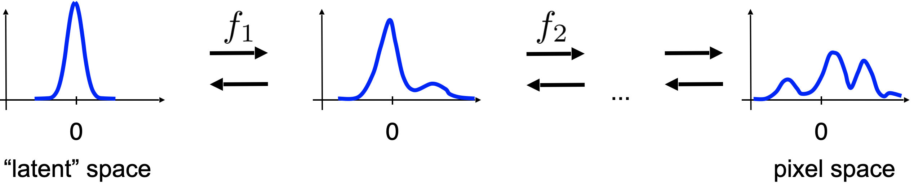

翻译自：https://jmtomczak.github.io/blog/3/3_flows.html


# 引言

到目前为止，我们讨论了一类以自回归方式直接对分布 $p(x)$ 建模的深度生成模型。自回归模型（ARMs）的主要优势在于它们能够学习长程统计信息，从而成为强大的密度估计器。然而，它们的缺点是通过自回归方式参数化，导致采样过程较为缓慢。此外，它们缺乏潜在表示，因此难以操纵内部数据表示，使其在有损压缩或度量学习等任务中不太理想。

在这篇文章中，我们提出了一种直接建模 $p(x)$ 的不同方法。在开始深入讨论之前，我们将先通过一个简单的例子进行说明。

# 例子  

我们取一个随机变量 $z \in \mathbb{R}$，其分布为 $\pi(z) = \mathcal N(z \mid 0, 1)$。现在，考虑对 $z$ 应用线性变换后得到的新随机变量，即 $x = 0.75z + 1$。接下来的问题是：$x$ 的分布 $p(x)$ 是什么？我们可以通过利用高斯分布的性质来猜测答案，或者使用变量变换公式来计算该分布，即：

$$
p(x) = \pi\left( z = f^{-1}(x) \right) \left| \frac{\partial f^{-1}(x)}{\partial x} \right|,
$$

其中，$f$ 是一个可逆函数（双射）。这意味着该函数将一个点映射到另一个不同的点，并且我们总是可以通过反函数来获得原始点。


在上图中，我们展示了一个非常简单的双射例子。请注意，域的体积并不需要相同！记住这一点，并在 $\left| \frac{\partial f^{-1}(x)}{\partial x} \right|$ 的上下文中思考它。

回到我们的例子中，我们有：

$$
f(z) = 0.75z + 1,
$$

其反函数为：

$$
f^{-1}(x) = \frac{x - 1}{0.75}.
$$

然后，体积变化的导数为：

$$
\left| \frac{\partial f^{-1}(x)}{\partial x} \right| = \frac{4}{3}.
$$

将所有结果结合在一起得到：

$$
p(x) = \pi\left( z = \frac{x - 1}{0.75} \right) \cdot \frac{4}{3} = \frac{1}{\sqrt{2\pi \cdot 0.75^2}} \exp\left( -\frac{(x - 1)^2}{0.75^2} \right).
$$

我们立刻意识到，最终得到的依然是高斯分布：

$$
p(x) = \mathcal N(x \mid 1, 0.75).
$$

此外，我们看到 $\left| \frac{\partial f^{-1}(x)}{\partial x} \right|$ 这一部分负责在应用变换 $f$ 后对分布 $\pi(z)$ 进行归一化。换句话说，$\left| \frac{\partial f^{-1}(x)}{\partial x} \right|$ 抵消了由 $f$ 引起的体积变化。

首先，这个例子表明我们可以通过对已知分布的随机变量 $z \sim p(z)$ 应用已知的双射变换 $f$ 来计算新的连续随机变量的分布。同样的原理也适用于多个变量 $x, z \in \mathbb{R}^D$：

$$
p(x) = p(z = f^{-1}(x)) \left| \frac{\partial f^{-1}(x)}{\partial x} \right|, \tag{1}
$$

其中：

$$
\left| \frac{\partial f^{-1}(x)}{\partial x} \right| = \left| \det J_{f^{-1}(x)} \right|
$$

是雅可比矩阵 $J_{f^{-1}}$，其定义如下：

$$
J_{f^{-1}} = \begin{bmatrix}
    \frac{\partial f_1^{-1}}{\partial x_1} & \cdots & \frac{\partial f_1^{-1}}{\partial x_D} \\
    \vdots & \ddots & \vdots \\
    \frac{\partial f_D^{-1}}{\partial x_1} & \cdots & \frac{\partial f_D^{-1}}{\partial x_D}
\end{bmatrix}.
$$

此外，我们还可以利用反函数定理，得到：

$$
\left| J_{f^{-1}(x)} \right| = \left| J_f(x) \right|^{-1}.
$$

由于 $f$ 是可逆的，我们可以使用反函数定理将公式 (1) 改写为：

$$
p(x) = p(z = f^{-1}(x)) \left| J_f(x) \right|^{-1}.
$$

为了更好地理解雅可比行列式的作用，请看图1。这里展示了三个可逆变换的例子，它们在一个定义在正方形上的均匀分布上进行操作。


**图1**. 三个可逆变换的例子：（上）体积保持的双射，（中）缩小原始区域的双射，（下）放大原始区域的双射。

在上面的例子中，变换将正方形变为菱形，但没有改变其体积。因此，该变换的雅可比行列式为1。这样的变换称为**volume-preserving**。注意，结果分布仍然是均匀的，并且由于体积没有变化，分布的颜色与原始分布相同。

在中间的例子中，变换缩小了体积，因此结果的均匀分布变得“更密集”（图1中的颜色更深）。此外，雅可比行列式小于1。

在最后的例子中，变换放大了体积，因此均匀分布定义在更大的区域上（图1中的颜色更浅）。由于体积变大，雅可比行列式大于1。

注意，平移操作是体积保持的。想象一下将一个任意值（例如5）加到正方形的所有点上，它会改变体积吗？当然不会！因此，雅可比行列式等于1。


# 深度生成模型中的变量变换

一个自然的问题是，是否可以利用变量变换的思想来对图像、音频或其他数据源上的复杂高维分布进行建模。让我们考虑一个分层模型，或者说是一个可逆变换序列 $f_k: \mathbb{R}^D \to \mathbb{R}^D$。我们从一个已知的分布开始 $\pi(z_0) = \mathcal N(z_0 \mid 0, I)$。然后，我们可以依次应用可逆变换来获得一个灵活的分布（参见 Rezende & Mohamed, 2015; Rippel & Adams, 2013）：

$$
p(x) = \pi(z_0 = f^{-1}(x)) \prod_{i=1}^K \left| \det \frac{\partial f_i(z_{i-1})}{\partial z_{i-1}} \right|^{-1}
$$

或者使用第 $i$ 个变换的雅可比矩阵表示：

$$
p(x) = \pi(z_0 = f^{-1}(x)) \prod_{i=1}^K \left| J_{f_i}(z_{i-1}) \right|^{-1}.
$$

图2展示了通过可逆变换将一个单峰基础分布（如高斯分布）转换为多峰分布的例子。理论上，我们应该能够获得几乎任意复杂的分布并将其逆转为一个“简单”的分布。



图2. 通过一系列可逆变换 $f_i$ 将单峰分布（潜在空间）转换为多峰分布（数据空间，例如像素空间）的示例。

设 $\pi(z_0) = \mathcal N(z_0 \mid 0, I)$。那么，$p(x)$ 的对数为：

$$
\ln p(x) = \ln \mathcal N(z_0 = f^{-1}(x) \mid 0, I) - \sum_{i=1}^K \ln \left| J_{f_i}(z_{i-1}) \right|. \tag{2}
$$

有趣的是，我们看到第一部分 $\ln \mathcal N(z_0 = f^{-1}(x) \mid 0, I)$ 对应于均方误差损失函数，用于衡量 $0$ 和 $f^{-1}(x)$ 之间的误差。第二部分 $\sum_{i=1}^K \ln \left| J_{f_i}(z_{i-1}) \right|$，如我们的例子所示，确保分布得到了正确的归一化。然而，由于它惩罚体积变化（再次看看上面的例子！），我们可以将其视为对可逆变换 $f_i$ 的一种正则化。

一旦我们建立了用变量变换来表达密度函数的基础，现在我们面临两个问题：

1. 如何建模可逆变换？
2. 这里的困难是什么？

第一个问题的答案可能是神经网络，因为它们灵活且易于训练。然而，我们不能选择任何神经网络，因为有两个原因。首先，变换必须是可逆的，因此我们必须选择可逆的神经网络。其次，即使神经网络是可逆的，我们还面临着计算公式 (2) 的第二部分 $\sum_{i=1}^K \ln \left| J_{f_i}(z_{i-1}) \right|$ 的问题，这对于任意一系列可逆变换来说是非平凡且计算上不可行的。因此，我们需要寻找那些既是可逆的，且其雅可比行列式的对数（相对）易于计算的神经网络。由这些可逆变换（神经网络）组成并具有可计算的雅可比行列式的模型被称为归一化流或基于流的模型。

有各种可逆神经网络具有可计算的雅可比行列式，例如，Planar Normalizing Flows (Rezende & Mohamed, 2015), Sylvester Normalizing Flows (van den Berg et al., 2018), Residual Flows (Behrmann et al., 2019; Chen et al., 2019), Invertible DenseNets (Perugachi-Diaz et al., 2021)。然而，在这里我们将重点讨论一种非常重要的模型类别：RealNVP，, *Real-valued Non-Volume Preserving* flows (Dinh et al., 2016)。


# 互联层、置换层和去量化

## **互联层 (Coupling Layers)** 

RealNVP 的主要组件是**互联层**。互联层的基本思想是将输入划分为两部分：$x = [x_a, x_b]$。这种划分可以通过将向量 $x$ 拆分为 $x_{1:d}$ 和 $x_{d+1:D}$，或者根据更复杂的方式，如棋盘模式(Dinh et al., 2016)）。然后定义变换为：
$$
y_a = x_a, \quad y_b = \exp(s(x_a)) \odot x_b + t(x_a),
$$

其中 $s(\cdot)$ 和 $t(\cdot)$ 是称为缩放和位移的神经网络。

这个变换是可逆的，具体为：

$$
x_b = (y_b - t(y_a)) \odot \exp(-s(y_a)), \quad x_a = y_a.
$$

重要的是，雅可比矩阵的行列式对数很容易计算，因为：

$$
J = \begin{bmatrix} 
I_{d \times d} & \frac{\partial y_b}{\partial x_a} \\
0_{d \times (D-d)} & \text{diag}(\exp(s(x_a)))
\end{bmatrix},
$$

因此，雅可比行列式为：

$$
\det(J) = \prod_{j=1}^{D-d} \exp(s(x_a)_j) = \exp \left( \sum_{j=1}^{D-d} s(x_a)_j \right).
$$

因此，互联层是灵活且强大的变换，且雅可比行列式的计算是可行的！然而，互联层只处理输入的一半，因此需要与其他变换相结合。


## **置换层 (Permutation Layer)**  

一种简单有效的变换是**置换层**。置换是体积保持的，即其雅可比行列式为 1，所以每次在互联层之后应用它。例如，我们可以反转变量的顺序。

互联层与置换层结合的一个可逆块的示意图如图3所示。


**图3**。一个互联层和一个置换层的组合，将转换为。A：通过该模块的forward pass。B：通过该模块的backward pass。


## **去量化 (Dequantization)**  

正如我们前面讨论的，流模型假设 $x$ 是实数随机变量的向量。但在实际中，很多对象是离散的。比如，图像通常表示为取值为 $\{0, 1, \ldots, 255\}^D$ 的整数。在(Theis et al., 2016)的研究中，提出了向原始数据 $y \in \{0, 1, \ldots, 255\}^D$ 添加均匀噪声 $u \in [-0.5, 0.5]^D$，从而将密度估计应用于 $x = y + u$。该过程称为**均匀去量化**。最近，也提出了不同的去量化方案，更多信息请参考(Hoogeboom et al., 2021)的研究。

对于两个二元随机变量的均匀去量化示例如图4所示。通过向每个离散值添加 $u \in [-0.5, 0.5]^2$，我们得到一个连续空间，原本与无体积点相关的概率现在“分散”到小正方形区域。


# 流模型实战

让我们把数学转化为代码！首先，我们讨论对数似然函数（即学习目标）以及数学公式如何对应到代码中。在这个示例中，我们使用了互联层和置换层，然后可以将互联层的雅可比行列式的对数代入（对于置换层其雅可比行列式为1，因此 $\ln(1) = 0$）公式中，得到：

$$
\ln p(x) = \ln \mathcal N(z_0 = f^{-1}(x) \mid 0, I) - \sum_{i=1}^{K} \left( \sum_{j=1}^{D-d} s_k(x_{k,a})_j \right),
$$

其中 $s_k$ 是第 $k$ 个互联层中的缩放网络，$x_{k,a}$ 表示输入。注意，互联层中的 $\exp$ 在对数雅可比行列式中被对消掉。

从实现的角度来看，我们首先需要通过计算 $f^{-1}(x)$ 得到 $z$，然后可以计算：

$$
\ln \mathcal N (z_0 = f^{-1}(x) \mid 0, I) = -\text{const} - \frac{1}{2} \| f^{-1}(x) \|^2,
$$

其中 $\text{const} = \frac{D}{2} \ln(2\pi)$ 是标准高斯分布的归一化常数，$\frac{1}{2} \| f^{-1}(x) \|^2 = MSE(0, f^{-1}(x))$。

接下来，我们处理对数雅可比行列式。对于每一个互联层，我们只需返回缩放网络的输出及其对应的缩放值即可。

现在，我们已经具备了实现 RealNVP 的所有组件！

```python
class RealNVP(nn.Module):
    def __init__(self, nets, nett, num_flows, prior, D=2, dequantization=True):
        super(RealNVP, self).__init__()
        
        # Well, it's always good to brag about yourself.
        print('RealNVP by JT.')
        
        # We need to dequantize discrete data. This attribute is used during training to dequantize integer data.
        self.dequantization = dequantization
        
        # An object of a prior (here: torch.distribution of multivariate normal distribution)
        self.prior = prior
        # A module list for translation networks
        self.t = torch.nn.ModuleList([nett() for _ in range(num_flows)])
        # A module list for scale networks
        self.s = torch.nn.ModuleList([nets() for _ in range(num_flows)])
        # The number of transformations, in our equations it is denoted by K.
        self.num_flows = num_flows
        
        # The dimensionality of the input. It is used for sampling.
        self.D = D

    # This is the coupling layer, the core of the RealNVP model.
    def coupling(self, x, index, forward=True):
        # x: input, either images (for the first transformation) or outputs from the previous transformation
        # index: it determines the index of the transformation
        # forward: whether it is a pass from x to y (forward=True), or from y to x (forward=False)
        
        # We chunk the input into two parts: x_a, x_b
        (xa, xb) = torch.chunk(x, 2, 1)
        
        # We calculate s(xa), but without exp!
        s = self.s[index](xa)
        # We calculate t(xa)
        t = self.t[index](xa)
        
        # Calculate either the forward pass (x -> z) or the inverse pass (z -> x)
        # Note that we use the exp here!
        if forward:
            #yb = f^{-1}(x)
            yb = (xb - t) * torch.exp(-s)
        else:
            #xb = f(y)
            yb = torch.exp(s) * xb + t
        
        # We return the output y = [ya, yb], but also s for calculating the log-Jacobian-determinant
        return torch.cat((xa, yb), 1), s

    # An implementation of the permutation layer
    def permute(self, x):
        # Simply flip the order.
        return x.flip(1)

    def f(self, x):
        # This is a function that calculates the full forward pass through the coupling+permutation layers.
        # We initialize the log-Jacobian-det
        log_det_J, z = x.new_zeros(x.shape[0]), x
        # We iterate through all layers
        for i in range(self.num_flows):
            # First, do coupling layer,
            z, s = self.coupling(z, i, forward=True)
            # then permute.
            z = self.permute(z)
            # To calculate the log-Jacobian-determinant of the sequence of transformations we sum over all of them.
            # As a result, we can simply accumulate individual log-Jacobian determinants.
            log_det_J = log_det_J - s.sum(dim=1)
        # We return both z and the log-Jacobian-determinant, because we need z to feed in to the logarightm of the Norma;
        return z, log_det_J

    def f_inv(self, z):
        # The inverse path: from z to x.
        # We appply all transformations in the reversed order.
        x = z
        for i in reversed(range(self.num_flows)):
            x = self.permute(x)
            x, _ = self.coupling(x, i, forward=False)
        # Since we use this function for sampling, we don't need to return anything else than x.
        return x

    def forward(self, x, reduction='avg'):
        # This function is essential for PyTorch.
        # First, we calculate the forward part: from x to z, and also we need the log-Jacobian-determinant.
        z, log_det_J = self.f(x)
        # We can use either sum or average as the output.
        # Either way, we calculate the learning objective: self.prior.log_prob(z) + log_det_J.
        # NOTE: Mind the minus sign! We need it, because, by default, we consider the minimization problem,
        # but normally we look for the maximum likelihood estimate. Therefore, we use:
        # max F(x) <=> min -F(x)
        if reduction == 'sum':
            return -(self.prior.log_prob(z) + log_det_J).sum()
        else:
            return -(self.prior.log_prob(z) + log_det_J).mean()

    def sample(self, batchSize):
        # First, we sample from the prior, z ~ p(z) = Normal(z|0,1)
        z = self.prior.sample((batchSize, self.D))
        z = z[:, 0, :]
        # Second, we go from z to x.
        x = self.f_inv(z)
        return x.view(-1, self.D)
```

```python
# The number of flows
num_flows = 8

# Neural networks for a single transformation (a single flow).
nets = lambda: nn.Sequential(nn.Linear(D // 2, M), nn.LeakyReLU(),
                             nn.Linear(M, M), nn.LeakyReLU(),
                             nn.Linear(M, D // 2), nn.Tanh())

nett = lambda: nn.Sequential(nn.Linear(D // 2, M), nn.LeakyReLU(),
                             nn.Linear(M, M), nn.LeakyReLU(),
                             nn.Linear(M, D // 2))

# For the prior, we can use the built-in PyTorch distribution.
prior = torch.distributions.MultivariateNormal(torch.zeros(D), torch.eye(D))

# Init of the RealNVP. Please note that we need to dequantize the data (i.e., uniform dequantization).
model = RealNVP(nets, nett, num_flows, prior, D=D, dequantization=True)
```

Viola！我们已经拥有了所需的一切。在运行代码并训练 RealNVP 后，我们应该能获得类似如下的结果：

**图5**：训练结果示例。

A 随机选择的真实图像：


B 从 RealNVP 生成的无条件样本：


C 训练期间的验证曲线：


这就是全部吗？真的是这样吗？

是，也不是。是，因为这是 RealNVP 的一个最小化实现示例。不是，因为还有很多可以改进的地方：

1. **Factoring out (Dinh et al., 2016)：**  
   在前向传播（从 $x$ 到 $z$）过程中，我们可以拆分变量，仅处理其中的一部分。这有助于通过使用中间层的输出来参数化基础分布。

2. **Rezero 技巧 (Bachlechner et al., 2020)：**  
   在互联层中引入额外的参数，例如 $y_b = \exp(\alpha s(x_a)) \odot x_b + \beta t(x_a)$，其中 $\alpha$ 和 $\beta$ 初始化为 0。这有助于在训练开始时使变换表现为恒等映射，从而在训练初期通过各层保持输入信息。该技术可以帮助学习更好的变换。

3. **掩码或棋盘模式 (Dinh et al., 2016)：**  
   我们可以使用棋盘模式，而不是将输入简单地分成 $[x_{1:D/2}, x_{D/2+1:D}]$ 两部分。这种方式可以更好地学习局部统计信息。

4. **压缩 (Dinh et al., 2016)：**  
   我们还可以尝试“压缩”一些维度。例如，一张图像由 $C$ 个通道、宽度 $W$ 和高度 $H$ 组成，可以转化为 4 个通道、宽度 $W/2$ 和高度 $H/2$。

5. **可学习的基础分布：**  
   与其使用标准高斯分布作为基础分布，我们可以使用其他模型，例如自回归模型。

6. **可逆的 1x1 卷积 (Kingma & Dhariwal, 2018)：**  
   可以用在 GLOW 模型中那种（可学习的）可逆 1x1 卷积替代固定的置换。

7. **变分去量化 (Ho et al., 2019a)：**  
   我们还可以选择不同的去量化方案，例如变分去量化。这能够获得更好的分数，但会引入对数似然函数的下界。

此外，还有很多新的令人兴奋的研究方向！我在这里列举一些，并给出相关论文，您可以在其中找到更多细节：

- **流模型压缩 (Ho et al., 2019b)：**  
  流模型是压缩的理想候选者，因为它们可以精确计算似然。Ho 等人提出了一种方案，可以将流模型用于类似 bit-back 的压缩方案。

- **条件流模型 (Stypulkowski et al., 2020, Winkler et al., 2019; Wolf et al., 2021)：**  
  我们展示的是无条件 RealNVP。然而，流模型也可以用于条件分布。例如，我们可以将条件作为输入提供给缩放网络和位移网络。

- **使用流模型的变分推理 (van den Berg et al., 2018; Kingma et al., 2016; Rezende & Mohamed, 2015; Hoogeboom et al., 2021; Tomczak & Welling, 2016; Tomczak & Welling, 2017)：**  
  条件流模型可以用于构造灵活的变分后验家族，从而提高对数似然函数下界的逼近精度。

- **整数离散流 (Hoogeboom et al., 2019; van den Berg et al., 2020; Tomczak, 2020)：**  
  另一个有趣的方向是 RealNVP 的整数值版本。我们将在另一篇博客中详细介绍。

- **流在流形上的应用 (Brehmer & Cranmer, 2020)：**  
  通常，流模型在欧几里得空间中讨论。但它们也可以在非欧几里得空间中应用，从而导致（部分）可逆变换的新特性。

关于流模型的更多有趣内容，可以参考 (Papamakarios et al., 2019) 的精彩综述。


# 引用

1. Bachlechner, T., Majumder, B. P., Mao, H. H., Cottrell, G. W., & McAuley, J. (2020). Rezero is all you need: Fast convergence at large depth. arXiv preprint arXiv:2003.04887.

2. Behrmann, J., Grathwohl, W., Chen, R. T., Duvenaud, D., & Jacobsen, J. H. (2019, May). Invertible residual networks. In International Conference on Machine Learning (pp. 573-582). PMLR.

3. van den Berg, Rianne, Leonard Hasenclever, Jakub M. Tomczak, and Max Welling. "Sylvester normalizing flows for variational inference." In 34th Conference on Uncertainty in Artificial Intelligence 2018, UAI 2018, pp. 393-402. Association For Uncertainty in Artificial Intelligence (AUAI), 2018.

4. van den Berg, R., Gritsenko, A. A., Dehghani, M., Sønderby, C. K., & Salimans, T. (2020). IDF++: Analyzing and Improving Integer Discrete Flows for Lossless Compression. arXiv preprint arXiv:2006.12459.

5. Brehmer, J., & Cranmer, K. (2020). Flows for simultaneous manifold learning and density estimation. Advances in Neural Information Processing Systems, 33.

6. Chen, R. T., Behrmann, J., Duvenaud, D. K., & Jacobsen, J. H. (2019). Residual flows for invertible generative modeling. In Advances in Neural Information Processing Systems (pp. 9916-9926).

7. Dinh, Laurent, Jascha Sohl-Dickstein, and Samy Bengio. "Density estimation using real nvp." arXiv preprint arXiv:1605.08803 (2016).

8. Ho, J., Chen, X., Srinivas, A., Duan, Y., & Abbeel, P. (2019). Flow++: Improving flow-based generative models with variational dequantization and architecture design. In International Conference on Machine Learning (pp. 2722-2730). PMLR.

9. Ho, J., Lohn, E., & Abbeel, P. (2019). Compression with flows via local bits-back coding. arXiv preprint arXiv:1905.08500.

10. Hoogeboom, E., Peters, J. W., Berg, R. V. D., & Welling, M. (2019). Integer discrete flows and lossless compression. arXiv preprint arXiv:1905.07376.

11. Hoogeboom, E., Cohen, T. S., & Tomczak, J. M. (2020). Learning Discrete Distributions by Dequantization. AABI 2021

12. Kingma, D. P., Salimans, T., Jozefowicz, R., Chen, X., Sutskever, I., & Welling, M. (2016). Improved variational inference with inverse autoregressive flow. Advances in neural information processing systems, 29, 4743-4751.

13. Kingma, D. P., & Dhariwal, P. (2018). GLOW: generative flow with invertible 1× 1 convolutions. In Proceedings of the 32nd International Conference on Neural Information Processing Systems (pp. 10236-10245).

14. Papamakarios, G., Nalisnick, E., Rezende, D. J., Mohamed, S., & Lakshminarayanan, B. (2019). Normalizing flows for probabilistic modeling and inference. arXiv preprint arXiv:1912.02762.

15. Perugachi-Diaz, Y., Tomczak, J. M., & Bhulai, S. (2021). Invertible DenseNets. AABI 2021

16. Rezende, D., & Mohamed, S. (2015). Variational Inference with Normalizing Flows. In International Conference on Machine Learning (pp. 1530-1538).

17. Rippel, O., & Adams, R. P. (2013). High-dimensional probability estimation with deep density models. arXiv

18. Stypulkowski, M., Kania, K., Zamorski, M., Zieba, M., Trzcinski, T., & Chorowski, J. (2020). Representing Point Clouds with Generative Conditional Invertible Flow Networks. arXiv preprint arXiv:2010.11087.

19. Theis, L., Oord, A. V. D., & Bethge, M. (2016). A note on the evaluation of generative models. ICLR 2016

20. Tomczak, J. M., & Welling, M. (2016). Improving variational auto-encoders using householder flow. arXiv preprint arXiv:1611.09630.

21. Tomczak, J. M., & Welling, M. (2017). Improving variational auto-encoders using convex combination linear inverse autoregressive flow. arXiv preprint arXiv:1706.02326.

22. Tomczak, J. M. (2020). General Invertible Transformations for Flow-based Generative Modeling. arXiv preprint arXiv:2011.15056.

23. Winkler, C., Worrall, D., Hoogeboom, E., & Welling, M. (2019). Learning likelihoods with conditional normalizing flows. arXiv preprint arXiv:1912.00042.

24. Wolf, V., Lugmayr, A., Danelljan, M., Van Gool, L., & Timofte, R. (2021). DeFlow: Learning Complex Image Degradations from Unpaired Data with Conditional Flows. arXiv preprint arXiv:2101.05796.