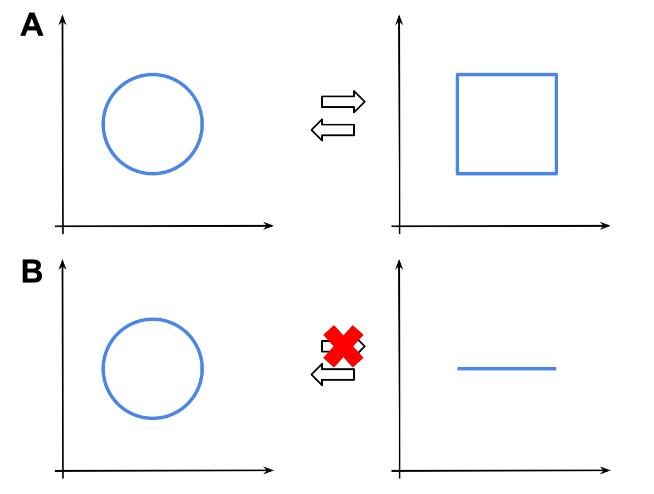
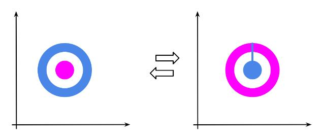
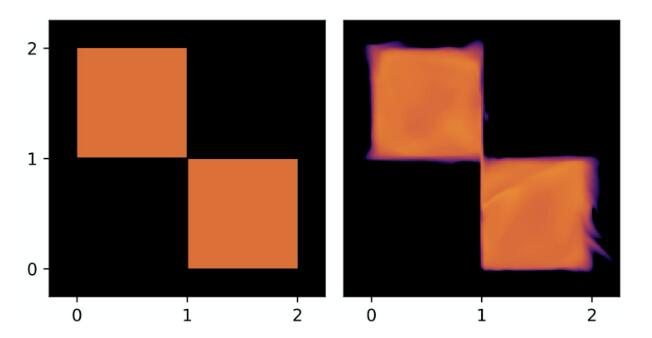
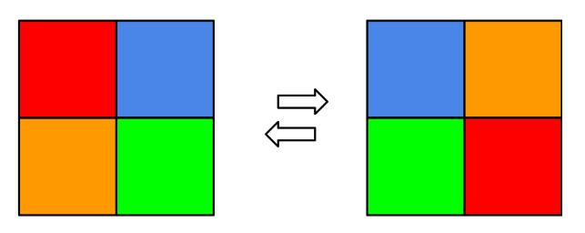
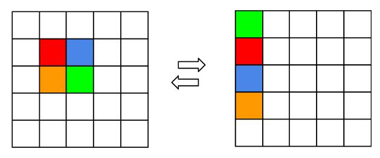
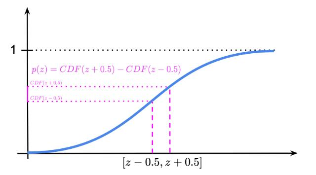
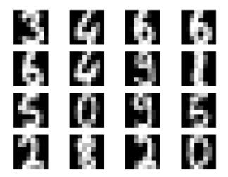
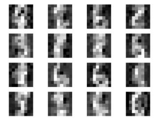

翻译自：https://jmtomczak.github.io/blog/5/5_IDF.html


# 引言

在讨论基于流的模型时，我们将它们呈现为密度估计器，即表示连续随机变量之间随机依赖关系的模型。我们介绍了变量变换公式，帮助通过使用可逆映射（双射）$f$ 将随机变量转换为已知概率密度函数的随机变量。其形式定义如下：

$$
p(x) = p(v = f^{-1}(x)) |J_f(x)|^{-1},
$$

其中 $J_f(x)$ 是 $f$ 在 $x$ 处的雅可比矩阵。

然而，这种方法存在潜在问题，主要有以下几点：

首先，在许多问题中（例如，图像处理），考虑的随机变量（对象）是离散的。例如，图像通常在 $\{0, 1, \ldots, 255\} \subset \mathbb{Z}$ 中取值。为了应用流模型，我们必须进行去量化 (Hoogeboom et al., 2021)，这会导致原始概率分布的下界。

连续空间具有多种潜在的陷阱。其中一个是，如果变换是双射（如流模型），并非所有的连续变换都是可能的。这与拓扑密切相关，具体来说，涉及同胚（即在拓扑空间之间的连续函数，具有连续的逆函数）和微分同胚（即可逆函数，将一个可微流形映射到另一个，同时函数及其逆都平滑）。了解拓扑并非至关重要，但有兴趣的读者可以探讨一下，这是一个迷人的领域。我们考虑三个例子。

想象一下我们想将一个正方形变换为一个圆（图1.A）。可以找到一个同胚（即双射），将正方形变换为圆，然后再变回去。假设你有一把锤子和一个铁制正方形。如果你不断敲打正方形，最终可以得到一个铁制圆形。然后，你可以“反向操作”将其变回正方形。我知道，这并不现实，但我们谈论的是数学！

然而，如果我们考虑一段线段和一个圆，情况就复杂了。可以将线段变换为圆，但反过来就不行了。为什么？因为在将圆变换为线段时，不清楚圆的哪个点对应于线段的起点（或终点）。这就是我们无法逆转变换的原因！



**图1.** 同胚空间（A）和非同胚空间（B）的例子。

我特别喜欢的另一个例子，与连续流的潜在问题更相关，是将一个环变换为一个球，如图2所示。目标是将蓝色环替换为品红色球。为了使变换为双射，在将蓝色环转变为品红色球的过程中，必须确保新的品红色“环”实际上是“破裂”的，以便新的蓝色“球”可以进入！再说一次，为什么？如果品红色环没有破裂，那么我们就无法说明蓝色球是如何进入的，这就破坏了双射性！用拓扑语言来说，这是不可能的，因为这两个空间是非同胚的。



**图2.** 用球（品红色）替换环（蓝色）的例子。

那么，这如何影响基于流的模型呢？希望你们中的一些人提出了这个问题，或者甚至想象可能的情况，这可能会妨碍流模型的学习。总体来说，我会说这没问题，我们不应该在没有或几乎没有错误的地方找缺陷。然而，如果你在处理需要去量化的流模型，那么你可能会发现类似于图3的情况。在这个简单的例子中，我们有两个离散随机变量，在均匀去量化后，形成两个概率质量相等的区域，以及两个概率质量为零的区域 (Hoogeboom et al., 2021)。训练流模型后，我们得到的密度估计器在真实分布具有零密度的地方分配了非零概率质量！此外，流中的变换必须是双射，因此，这两个正方形之间必须存在连续性（见图3，右）。我们在哪里见过这种情况？是的，在图2中！我们必须知道如何逆转变换，因此必须有“痕迹”表明概率质量在区域之间是如何移动的。



**图3.** 均匀去量化的离散随机变量（左）和基于流的模型（右）的示例。注意，在这些示例中，真实分布将相等的概率质量分配给两个区域（橙色），并将零概率质量分配给其余两个区域（黑色）。但是，基于流的模型在原始非零概率区域之外分配了概率质量。

我们可以再次问自己，这是否不好。嗯，我会说不算太糟，但如果我们考虑到更多的随机变量，并且每个地方都有一些小误差，这个概率质量泄漏的问题将导致一个远非完美的模型。而且，整体上，模型在正确的概率分配上可能会出错。


# 流在 $\mathbb{R}$ 或者在 $\mathbb{Z}$？

在讨论任何具体情况和离散流之前，我们首先需要回答是否存在离散随机变量的变量变换公式。幸运的是，答案是肯定的！让我们考虑 $x \in \mathcal X^D$，其中 $\mathcal X$ 是离散空间，例如 $\mathcal X = \{0, 1\}$ 或 $\mathcal X = \mathbb{Z}$。那么，变量变换的形式如下：

$$
p(x) = \pi(z_0 = f^{-1}(x)),
$$

其中 $f$ 是可逆变换，$\pi(\cdot)$ 是基础分布。我们可以立即发现一个“缺失”的雅可比。这是正确的！为什么？因为现在我们生活在离散的世界里，概率质量被分配到“无形”的点上，而双射不能改变体积。因此，雅可比行列式等于 1！这似乎是个好消息，不是吗？我们可以采取任何双射变换，而不必担心雅可比。这显然是正确的，然而，我们需要记住变换的输出仍然必须是离散的，即 $z \in \mathcal X^D$。结果是，我们不能使用任何任意的可逆神经网络。我们稍后会讨论这个问题，但在此之前，值得讨论离散流的表现能力。

假设我们有一个可逆变换 $f: \mathcal X^D \to \mathcal X^D$。而且我们有 $\mathcal X  = \{0, 1\}$。正如 (Papamakarios et al., 2019)所指出的，离散流只能置换概率质量。由于没有雅可比（或者说，雅可比行列式等于 1），没有机会增加或减少特定值的概率。我们在图4中描绘了这一点。你可以很容易地想象这是一个魔方，你的手就是流。如果你记录下你的移动，你总能倒带播放视频，因此它是可逆的。然而，你只能随机排列颜色！因此，应用离散流并不会带来任何好处，学习离散流等同于学习基础分布 $\pi$。所以我们回到了起点。



**图4.** 两个离散随机变量的离散流示例。颜色表示不同的概率（即所有方块的总和为 1）。

然而，正如 (van den Berg et al., 2020) 指出的，如果我们考虑一个扩展空间（或无限空间，如 $\mathbb{Z}$），情况就有所不同。离散流仍然只能随机排列概率，但现在它可以以某种方式重新组织这些概率，使得概率可以被分解！换句话说，它可以帮助基础分布成为边际的乘积，即 $\pi(z) = \prod_{d=1}^D \pi_d(z_d | \theta_d)$，而变量之间的依赖关系现在被编码在可逆变换中。图5展示了这种情况的一个例子。我们参考 (van den Berg et al., 2020) 以获取更详细的讨论和适当的引理。



**图5.** 两个离散随机变量在扩展空间中的离散流示例。颜色表示不同的概率（即所有方块的总和为 1）。

这太棒了！这意味着在离散空间中构建基于流的模型是有意义的。现在我们可以思考如何在离散空间中构建可逆神经网络。


# 整数离散流

我们现在知道，处理离散流是有意义的，并且只要我们使用扩展空间或无限空间（如 $\mathbb{Z}$），它们都是灵活的。然而，问题在于如何制定一个可逆变换（或者说：可逆神经网络），使其输出离散值。

 (Hoogeboom et al., 2021) 提出了关注整数，因为它们可以被视为离散化的连续值。因此，我们考虑互联层 (Coupling Layers) (Dinh et al., 2016) 并相应地进行修改。我们先回顾一下耦合层的定义，对于 $x \in \mathbb{R}^D$：

$$
\begin{aligned}
y_a &=x_a  \\
y_b &= \exp(s(x_a)) \odot x_b + t(x_a),
\end{aligned}
$$

其中 $s(\cdot)$ 和 $t(\cdot)$ 是称为缩放和转移的任意神经网络。

考虑到整数值变量 $x \in \mathbb{Z}^D$，需要对该变换进行修改。首先，使用缩放可能会引发问题，因为虽然乘以整数是可能的，但当我们反转变换时，需要除以整数，而除以整数不一定会得到整数。因此，我们必须去掉缩放。其次，我们使用任意神经网络进行转移，但该网络必须返回整数！(Hoogeboom et al., 2019) 使用了一个简单的技巧，即他们提出可以将 $t(\cdot)$ 的输出四舍五入到最近的整数。最终，我们得到以下耦合层：

$$
\begin{aligned}
y_a &=x_a  \\
y_b &=  x_b + \lfloor t(x_a) \rceil,
\end{aligned}
$$

其中 $\lfloor \cdot \rceil$ 是四舍五入算子。此时，一个好奇的读者可能会问，四舍五入算子是否仍允许使用反向传播算法。换句话说，四舍五入算子是否可微。答案是否定的，但 (Hoogeboom et al., 2019) 显示，使用直通估计器（STE）计算梯度是足够的。值得一提的是，这里的 STE 在网络的前向传播中使用四舍五入 $\lfloor t(x_a) \rceil$，但在反向传播中使用 $t(x_a)$（用于计算梯度）。(van den Berg et al., 2020) 进一步指出，确实，STE 的使用效果良好，偏差不会妨碍训练。

最近，(Tomczak, 2020) 展示了如何推广可逆变换，比如bipartite coupling层等。例如，我们可以将 $x$ 划分为四个部分 $x = [x_a, x_b, x_c, x_d]$，并且以下变换是可逆的（Tomczak, 2020）：

$$
\begin{aligned}
& {y}_a={x}_a+\left\lfloor t\left({x}_b, {x}_c, {x}_d\right)\right\rceil \\
& {y}_b={x}_b+\left\lfloor t\left({y}_a, {x}_c, {x}_d\right)\right\rceil \\
& {y}_c={x}_c+\left\lfloor t\left({y}_a, {y}_b, {x}_d\right)\right\rceil \\
& {y}_d={x}_d+\left\lfloor t\left({y}_a, {y}_b, {y}_c\right)\right\rceil .
\end{aligned}
$$

这种新的可逆变换可以被视为一种自回归处理，因为 $y_a$ 用于计算 $y_b$，然后 $y_a$ 和 $y_b$ 一起用于获得 $y_c$，依此类推。因此，我们得到比二分耦合层更强大的变换。

我们需要记得使用置换层来逆转变量的顺序。否则，一些输入将仅被部分处理。这对于任何coupling层都是成立的。

最后一个需要考虑的组件是基础分布。与基于流的模型类似，我们可以使用各种技巧来提升模型性能。例如，我们可以考虑压缩、因式分解和基础分布的混合模型（Hoogeboom et al., 2019）。然而，在这篇文章中，我们尽量保持模型尽可能简单，因此我们使用边际的乘积作为基础分布。对于以整数表示的图像，我们使用以下公式：

$$
\pi(z) = \prod_{d=1}^D \pi_d(z_d) = \prod_{d=1}^D DL(z_d | \mu_d, \nu_d),
$$

其中 $\pi_d(z_d) = DL(z_d | \mu_d, \nu_d)$ 是离散化的logistic分布，定义为logistic分布的CDF差，如下所示（Chakraborty & Chakravarty, 2016）：

$$
\pi(z) = \text{sigm}\left(\frac{z + 0.5 - \mu}{\nu}\right) - \text{sigm}\left(\frac{z - 0.5 - \mu}{\nu}\right),
$$

其中 $\mu \in \mathbb{R}$ 和 $\nu > 0$ 分别表示均值和尺度，$\text{sigm}(\cdot)$ 是sigmoid函数。注意，这等价于计算 $z$ 落入长度为1的箱子的概率，因此在第一个CDF中加上 0.5，第二个CDF中减去 0.5。离散化分布的一个例子如图6所示。有趣的是，我们可以使用这种分布替代之前帖子中的分类分布，正如 (Kingma et al., 2016) 所做的那样。我们甚至可以使用离散化逻辑分布的混合体来进一步提高最终性能（Hoogeboom et al., 2019; Salimans et al., 2017）。



**图6.** 离散化逻辑分布的示例，$\mu=0$ 和 $\nu=1$。品红色区域对应于大小为1的箱子的概率质量。

最终，我们的对数似然函数形式如下：

$$
\ln p(x) = \sum_{d=1}^D \ln DL(z_d = f^{-1}(x) | \mu_d, \nu_d) = \sum_{d=1}^D \ln\left(\text{sigm}\left(\frac{z_d + 0.5 - \mu_d}{\nu_d}\right) - \text{sigm}\left(\frac{z_d - 0.5 - \mu_d}{\nu_d}\right)\right),
$$

其中我们使所有 $\mu_d$ 和 $\nu_d$ 成为可学习的参数。注意，$\nu_d$ 必须为正（严格大于 0），因此，在实现中，我们将考虑尺度的对数，因为对数取指数可以确保得到严格正值。

现在，我们拥有实现自己的整数离散流（IDF）的所有组件！下面是带有大量注释的代码，应该有助于理解每一行。完整代码（包括辅助函数）可以在这里找到：[链接](https://github.com/jmtomczak/intro_dgm)。

```python
# This function implements the log of the discretized logistic distribution.
# Chakraborty & Chakravarty, "A new discrete probability distribution with integer support on (−∞, ∞)",
#  Communications in Statistics - Theory and Methods, 45:2, 492-505, DOI: 10.1080/03610926.2013.830743
def log_integer_probability(x, mean, logscale):
    scale = torch.exp(logscale)

    logp = log_min_exp(
        F.logsigmoid((x + 0.5 - mean) / scale),
        F.logsigmoid((x - 0.5 - mean) / scale))

    return logp
    
# We need to also turn torch.round (i.e., the rounding operator) into a differentiable function.
# For this purpose, we use the rounding in the forward pass, but the original input for the backward pass.
# This is nothing else than the straight-through estimator.
class RoundStraightThrough(torch.autograd.Function):

    def __init__(self):
        super().__init__()

    @staticmethod
    def forward(ctx, input):
        rounded = torch.round(input, out=None)
        return rounded

    @staticmethod
    def backward(ctx, grad_output):
        grad_input = grad_output.clone()
        return grad_input
        
# That's the class of the Integer Discrete Flows (IDFs).
# There are two options implemented:
# Option 1: The bipartite coupling layers as in (Hoogeboom et al., 2019).
# Option 2: A new coupling layer with 4 parts as in (Tomczak, 2020).
# We implemnet the second option explicitely, without any loop, so that it is very clear how it works.
class IDF(nn.Module):
    def __init__(self, netts, num_flows, D=2):
        super(IDF, self).__init__()

        print('IDF by JT.')
        
        # Option 1:
        if len(netts) == 1:
            self.t = torch.nn.ModuleList([netts[0]() for _ in range(num_flows)])
            self.idf_git = 1
        
        # Option 2:
        elif len(netts) == 4:
            self.t_a = torch.nn.ModuleList([netts[0]() for _ in range(num_flows)])
            self.t_b = torch.nn.ModuleList([netts[1]() for _ in range(num_flows)])
            self.t_c = torch.nn.ModuleList([netts[2]() for _ in range(num_flows)])
            self.t_d = torch.nn.ModuleList([netts[3]() for _ in range(num_flows)])
            self.idf_git = 4
        
        else:
            raise ValueError('You can provide either 1 or 4 translation nets.')
        
        # The number of flows (i.e., invertible transformations).
        self.num_flows = num_flows
        
        # The rounding operator
        self.round = RoundStraightThrough.apply
        
        # Initialization of the parameters of the base distribution.
        # Notice they are parameters, so they are trained alongside the weights of neural networks.
        self.mean = nn.Parameter(torch.zeros(1, D)) #mean
        self.logscale = nn.Parameter(torch.ones(1, D)) #log-scale
        
        # The dimensionality of the problem.
        self.D = D
    
    # The coupling layer.
    def coupling(self, x, index, forward=True):
        
        # Option 1:
        if self.idf_git == 1:
            (xa, xb) = torch.chunk(x, 2, 1)
            
            if forward:
                yb = xb + self.round(self.t[index](xa))
            else:
                yb = xb - self.round(self.t[index](xa))
            
            return torch.cat((xa, yb), 1)
        
        # Option 2:
        elif self.idf_git == 4:
            (xa, xb, xc, xd) = torch.chunk(x, 4, 1)
            
            if forward:
                ya = xa + self.round(self.t_a[index](torch.cat((xb, xc, xd), 1)))
                yb = xb + self.round(self.t_b[index](torch.cat((ya, xc, xd), 1)))
                yc = xc + self.round(self.t_c[index](torch.cat((ya, yb, xd), 1)))
                yd = xd + self.round(self.t_d[index](torch.cat((ya, yb, yc), 1)))
            else:
                yd = xd - self.round(self.t_d[index](torch.cat((xa, xb, xc), 1)))
                yc = xc - self.round(self.t_c[index](torch.cat((xa, xb, yd), 1)))
                yb = xb - self.round(self.t_b[index](torch.cat((xa, yc, yd), 1)))
                ya = xa - self.round(self.t_a[index](torch.cat((yb, yc, yd), 1)))
            
            return torch.cat((ya, yb, yc, yd), 1)
    
    # Similalry to RealNVP, we have also the permute layer.
    def permute(self, x):
        return x.flip(1)
    
    # The main function of the IDF: forward pass from x to z.
    def f(self, x):
        z = x
        for i in range(self.num_flows):
            z = self.coupling(z, i, forward=True)
            z = self.permute(z)

        return z
    
    # The function for inverting z to x.
    def f_inv(self, z):
        x = z
        for i in reversed(range(self.num_flows)):
            x = self.permute(x)
            x = self.coupling(x, i, forward=False)

        return x
    
    # The PyTorch forward function. It returns the log-probability.
    def forward(self, x, reduction='avg'):
        z = self.f(x)
        if reduction == 'sum':
            return -self.log_prior(z).sum()
        else:
            return -self.log_prior(z).mean()
    
    # The function for sampling:
    # First we sample from the base distribution.
    # Second, we invert z.
    def sample(self, batchSize, intMax=100):
        # sample z:
        z = self.prior_sample(batchSize=batchSize, D=self.D, intMax=intMax)
        # x = f^-1(z)
        x = self.f_inv(z)
        return x.view(batchSize, 1, self.D)
    
    # The function for calculating the logarithm of the base distribution.
    def log_prior(self, x):
        log_p = log_integer_probability(x, self.mean, self.logscale)
        return log_p.sum(1)
    
    # A function for sampling integers from the base distribution.
    def prior_sample(self, batchSize, D=2):
        # Sample from logistic
        y = torch.rand(batchSize, self.D)
        # Here we use a property of the logistic distribution:
        # In order to sample from a logistic distribution, first sample y ~ Uniform[0,1].
        # Then, calculate log(y / (1.-y)), scale is with the scale, and add the mean.
        x = torch.exp(self.logscale) * torch.log(y / (1. - y)) + self.mean
        # And then round it to an integer.
        return torch.round(x)
        
        
# The number of invertible transformations
num_flows = 8

# This variable defines whether we use: 
#   Option 1: 1 - the classic coupling layer proposed in (Hogeboom et al., 2019)
#   Option 2: 4 - the general invertible transformation in (Tomczak, 2020) with 4 partitions
idf_git = 1

if idf_git == 1:
    nett = lambda: nn.Sequential(nn.Linear(D // 2, M), nn.LeakyReLU(),
                                     nn.Linear(M, M), nn.LeakyReLU(),
                                     nn.Linear(M, D // 2))
    netts = [nett]

elif idf_git == 4:
    nett_a = lambda: nn.Sequential(nn.Linear(3 * (D // 4), M), nn.LeakyReLU(),
                                       nn.Linear(M, M), nn.LeakyReLU(),
                                       nn.Linear(M, D // 4))

    nett_b = lambda: nn.Sequential(nn.Linear(3 * (D // 4), M), nn.LeakyReLU(),
                                       nn.Linear(M, M), nn.LeakyReLU(),
                                       nn.Linear(M, D // 4))

    nett_c = lambda: nn.Sequential(nn.Linear(3 * (D // 4), M), nn.LeakyReLU(),
                                       nn.Linear(M, M), nn.LeakyReLU(),
                                       nn.Linear(M, D // 4))

    nett_d = lambda: nn.Sequential(nn.Linear(3 * (D // 4), M), nn.LeakyReLU(),
                                       nn.Linear(M, M), nn.LeakyReLU(),
                                       nn.Linear(M, D // 4))
    
    netts = [nett_a, nett_b, nett_c, nett_d]

# Init IDF
model = IDF(netts, num_flows, D=D)
# Print the summary (like in Keras)
print(summary(model, torch.zeros(1, 64), show_input=False, show_hierarchical=False))
```


# 完成了！

我们已经完成了所有必要的步骤！在运行代码后（请查看：[链接](https://github.com/jmtomczak/intro_dgm)）并训练整数离散流（IDF），我们应该获得类似以下的结果：

**A**



**B**



**C**


**图5.** 训练结果示例：A 随机选择的真实图像。B 使用二分耦合层（选项1）生成的无条件图像。C 使用四分区耦合层（选项2）生成的无条件图像。

# 接下来是什么？

与我们的 RealNVP 示例类似，这里我们提供的是 IDF 的简化实现。我们可以使用在RealNVP文章中提出的许多技巧。有关IDF的最新发展，请参见 (van den Berg et al., 2020)。

整数离散流在压缩方面具有巨大潜力。由于 IDF 直接学习整数值对象的分布 $p(x)$，它们是无损压缩的优秀候选者。如 (Hoogeboom et al., 2019) 所示，它们在图像的无损压缩方面与其他编解码器具有竞争力。

(van den Berg et al., 2020) 的最新论文进一步表明，梯度的STE可能导致的潜在偏差并不是特别显著，它们可以学习灵活的分布。这一结果表明，IDF 在真实应用（如压缩）中需要特别关注。

下一步可能是考虑对离散变量的更强大变换（例如，参见 (Tomczak, 2020)）以及开发更强大的架构。另一个有趣的方向是利用替代学习算法，这些算法可以更好地估计梯度，甚至可以替代梯度。 

这个方向的探索可能会为离散流的应用和性能带来新的突破！


# 引用

1. van den Berg, R., Gritsenko, A. A., Dehghani, M., Sønderby, C. K., & Salimans, T. (2020). IDF++: Analyzing and Improving Integer Discrete Flows for Lossless Compression. arXiv preprint arXiv:2006.12459.

2. Chakraborty, S., & Chakravarty, D. (2016). A new discrete probability distribution with integer support on (−∞, ∞). Communications in Statistics-Theory and Methods, 45(2), 492–505.

3. Dinh, L., Sohl-Dickstein, J., & Bengio, S. (2016). Density estimation using real nvp. arXiv preprint arXiv:1605.08803.

4. Hoogeboom, E., Peters, J. W., van den Berg, R., & Welling, M. (2019). Integer discrete flows and lossless compression. arXiv preprint arXiv:1905.07376.

5. Hoogeboom, E., Cohen, T. S., & Tomczak, J. M. (2020). Learning Discrete Distributions by Dequantization. AABI 2021.

6. Kingma, D. P., Salimans, T., Jozefowicz, R., Chen, X., Sutskever, I., & Welling, M. (2016). Improved Variational Inference with Inverse Autoregressive Flow. Advances in Neural Information Processing Systems, 29, 4743-4751.

7. Papamakarios, G., Nalisnick, E., Rezende, D. J., Mohamed, S., & Lakshminarayanan, B. (2019). Normalizing flows for probabilistic modeling and inference. arXiv preprint arXiv:1912.02762.

8. Salimans, T., Karpathy, A., Chen, X., & Kingma, D. P. (2017). Pixelcnn++: Improving the pixelcnn with discretized logistic mixture likelihood and other modifications. arXiv preprint arXiv:1701.05517.

9. Theis, L., van den Oord, A., & Bethge, M. (2016). A note on the evaluation of generative models. ICLR 2016.

10. Tomczak, J. M. (2020). General Invertible Transformations for Flow-based Generative Modeling. arXiv preprint arXiv:2011.15056.